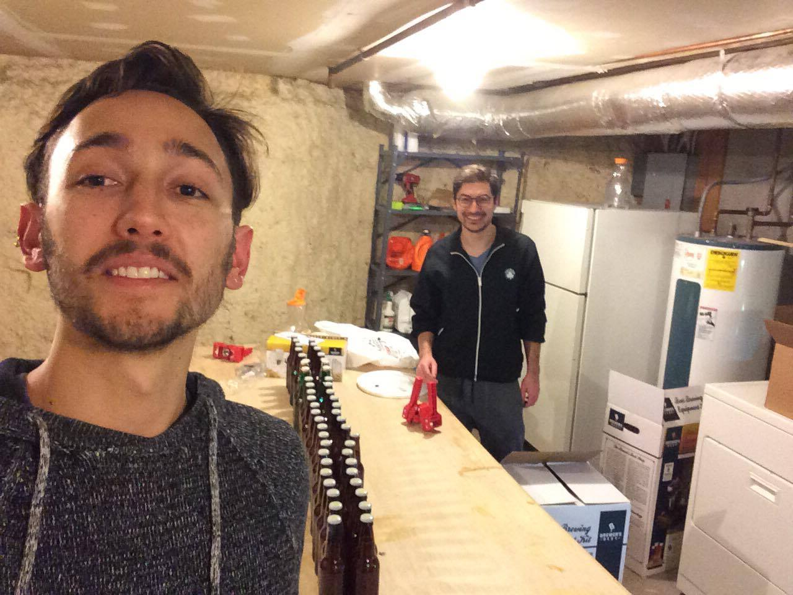

# Dependencies

* 8oz Biscuit Malt (for steeping)
* One bottle Light Malt Extract
* One packet Dry Malt Extract
* Bittering hop: 1oz Chinook Pellets
* Flavoring hop: 1oz Cascade Pellets
* Aroma hop: 1oz Centennial Pellets

# Specs

* Original Gravity: 1.058 (ideal), ?? reported.
* Terminal Gravity: 1.013 (ideal), 1.009 reported.
* Bitterness: 44 IBU
* Alcohol: 6.0% A.B.V., 4.8% A.B.W.

# Installation

1. Sanitize everything
2. Steeping. Pour 2-2.5 gallons of water in brew pot, bring to 155 F. Put biscuit malt grains in stepping bag, put simmer in water for 10-15 min.
3. Malting. Bring pot to boil, remove from heat. Add both malt extracts slowly, mixing throughout. Stir until everything has dissolved. Return to heat.
4. Boiln'n'hop. Boil above ingredients for a total of 1 hour, adding during this time:
    1. (@T=0) Chinook pellets
    2. (@T=45min) Cascade Pellets
    3. (@T=55min) Centennial Pellets
5. Cool. Remove from heat, bring down to ?? F. Transfer brew pot to ice bath to accelerate cooling. Measure temperature continuously. Avoid removing from ice too early, it's better for it to be cooler than have to wait long time before reaching optimal temperature.
6. Fill fermenter with 2 gallons of room-temperature water. Splash wort into the fermenter

# Images

<!-- # Youtube videos -->
<!-- <iframe width="560" height="315" src="https://www.youtube.com/embed/xecEV4dSAXE" frameborder="0" allowfullscreen></iframe> -->
